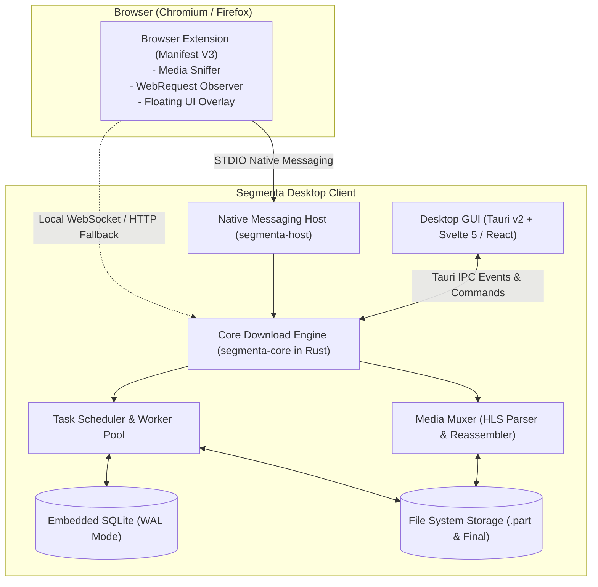

# Product Requirements Document (PRD)
## Segmenta — Modern Open-Source Internet Download Manager & Media Grabber

**Version:** 1.0.0  
**Status:** Ready for Implementation  
**License:** MIT / Apache-2.0  
**Target Platforms:** Windows 10/11, macOS, Linux (Desktop Client), Chromium & Firefox (Browser Extension)  
**Authors:** Core Maintainers & Software Architects  

---

# 1. Executive Summary & Problem Statement

## 1.1 Background & Problem Space
Modern internet users, software developers, researchers, and content creators frequently download large files, datasets, media streams, and software binaries. While commercial proprietary tools such as Internet Download Manager (IDM) have long dominated this space, they present distinct drawbacks:
- **Proprietary & Paid Licensing:** Restrictive activation schemes, paywalls, and lack of community contribution.
- **Closed Ecosystem & Opacity:** No visibility into how segmentation, connection pooling, and reassembly are handled under the hood.
- **Outdated UI/UX:** Cluttered interfaces that fail to integrate with modern operating systems and design standards.
- **Inflexible Media Grabbers:** Difficulty adapting to newer web media formats, adaptive streaming (HLS/M3U8), and modern browser sandbox limitations (Manifest V3).

**Segmenta** solves these problems by providing an open-source, high-performance, modular download manager written in **Rust** and **Tauri v2**, paired with a **Manifest V3 Browser Extension**.

## 1.2 Value Proposition
1. **Multi-Connection Dynamic Slicing:** Splits files into up to 32 parallel HTTP `Range` segments with automatic fallback to single-stream downloads when range headers are unsupported.
2. **Intelligent Media Grabber:** Automatically sniffs video/audio media (`.mp4`, `.mp3`, `.m3u8`, `.webm`) and injects a floating download trigger while preserving cookies, `Referer`, and `User-Agent`.
3. **High Performance & Minimal Resource Footprint:** Memory usage < 50MB RAM idle, low CPU consumption (< 5%), and non-blocking asynchronous disk writes via Tokio.
4. **Modern, Polished Interface:** Built with Plus Jakarta Sans, JetBrains Mono, and the visual design tokens specified in `DESIGN.md`.
5. **Open Source & Privacy First:** Zero telemetry, no ads, transparent code, and cross-platform native execution.

---

# 2. Target User Personas & Detailed Workflows

## 2.1 Personas
- **Developer / Power User ("Rangga"):** Requires rapid downloads of ISOs, datasets, and release binaries; needs bandwidth throttling and command-line friendly APIs.
- **Content Creator / Curator ("Sinta"):** Needs one-click extraction of web videos and streaming media with automatic reassembly into `.mp4`.
- **Researcher / Data Analyst ("Bu Lestari"):** Needs scheduled queue downloads during off-peak hours and automatic file categorization with checksum verification.

## 2.2 Core Workflows
1. **Desktop Direct Download:** User adds a URL directly via `Ctrl+N` or clipboard auto-detection -> Segmenta probes headers, calculates chunks, and downloads in parallel.
2. **Browser Sniff & Capture:** User visits a webpage playing a video -> Extension sniffs the stream, presents a floating "Download Video" button -> Forwards task + auth context to Desktop Engine via Native Messaging.
3. **Automatic Error Recovery:** If network drops -> Engine marks task `PAUSED_BY_ERROR` -> Exponential backoff with jitter retries up to 5 times -> Resumes seamlessly from the exact byte offset.

---

# 3. System Architecture & Component Specification

---

# 4. Functional Requirements (FR)

### FR-01: Core Download Engine & Dynamic Slicing
- **FR01-1 (Range Slicing):** Dynamically partitions files into $N$ segments (1–32) using HTTP `Range: bytes=start-end`.
- **FR01-2 (Fallback Handling):** Gracefully falls back to single-stream download if server returns `200 OK` on a Range request.
- **FR01-3 (Resume & Persistence):** Persists byte offsets to SQLite so paused or interrupted tasks resume exactly where they stopped.
- **FR01-4 (Bandwidth Throttling):** Enforces global and per-task speed limits using a Token Bucket algorithm.
- **FR01-5 (Checksum Verification):** Computes and verifies SHA-256 / MD5 hashes upon download completion.

### FR-02: Browser Extension & Media Grabber
- **FR02-1 (Manifest V3 Compatibility):** Operates on Chrome, Edge, Brave, and Firefox.
- **FR02-2 (Stream Sniffer):** Captures video/audio requests (`video/*`, `audio/*`, `application/vnd.apple.mpegurl`).
- **FR02-3 (Context Preservation):** Forwards `Cookie`, `Referer`, `Origin`, and `User-Agent` to the engine.
- **FR02-4 (Floating UI):** Injects a responsive, non-intrusive floating download button on web media players.

### FR-03: IPC Protocol & Native Messaging
- **FR03-1 (Native Messaging Bridge):** Exchanges 4-byte length-prefixed JSON messages over STDIN/STDOUT via `segmenta-host`.
- **FR03-2 (Local HTTP & WS Server):** Listens on `127.0.0.1:8456` with Bearer Token authentication for local integration and fallback.

### FR-04: Desktop UI/UX & Task Management
- **FR04-1 (Dashboard & Queue):** Displays download items with progress, speed, ETA, and state indicators.
- **FR04-2 (Segment Inspector):** Real-time multi-part visualizer illustrating connection chunks and chunk throughput.
- **FR04-3 (Speedometer):** 60fps Canvas area chart rendering live transfer speeds.
- **FR04-4 (Auto-Categorization):** Automatically assigns downloads into Video, Audio, Documents, Archives, Applications, and Other.
- **FR04-5 (System Integration):** System Tray menu, Windows/macOS native notifications with "Open File" / "Open Folder" actions.

---

# 5. Non-Functional Requirements & Performance SLAs

| Metric | Target SLA |
| :--- | :--- |
| **Idle RAM Footprint** | $\le 50$ MB |
| **Active Task Overhead** | $\le 15$ MB per task + 2 MB per active connection |
| **CPU Usage (8 Segments)** | $\le 5\%$ of a modern CPU core |
| **UI Response Latency (P95)** | $\le 50$ ms for state transitions |
| **Download Success Rate (DSR)** | $\ge 95\%$ across standard web hosts |
| **Crash-Free Sessions** | $\ge 99.9\%$ |

---

# 6. Phased Implementation Roadmap

1. **Phase 1: Foundation & Core Engine (Rust):** Monorepo setup, SQLite storage, dynamic multi-connection slicing, resume logic, and integration tests.
2. **Phase 2: Desktop GUI & Real-time Visualizer (Tauri v2):** Dashboard, segment inspector, live canvas speedometer, settings, and tray integration.
3. **Phase 3: Browser Extension (Manifest V3) & Native Messaging:** Background worker, media sniffer, floating action overlay, and STDIN/STDOUT IPC bridge.
4. **Phase 4: HLS/M3U8 Streaming, Packaging & Open-Source Release:** Adaptive stream parser, reassembler, multi-platform CI/CD packaging, and documentation.
