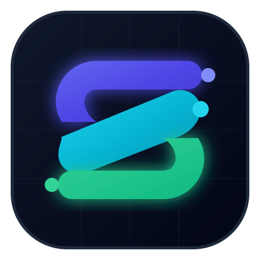

# Segmenta

<p align="center">
  
</p>

<p align="center">
  <strong>Pengelola Unduhan Internet Cepat, Modular, dan Menghormati Privasi dengan Media Grabber Cerdas.</strong>
</p>

<p align="center">
  <strong>Languages:</strong> <a href="README.md">English</a> | <a href="README.id.md">Bahasa Indonesia</a> | <a href="README.es.md">Español</a> | <a href="README.zh.md">简体中文</a> | <a href="README.ja.md">日本語</a>
</p>

<p align="center">
  <a href="https://github.com/prodhokter/segmenta/actions"></a>
  <a href="LICENSE"></a>
  <a href="https://www.rust-lang.org/"></a>
  <a href="https://v2.tauri.app/"></a>
  <a href="https://svelte.dev/"></a>
  <a href="https://developer.chrome.com/docs/extensions/develop/migrate/manifest-v3"></a>
</p>

---

## 📌 Gambaran Umum

**Segmenta** adalah aplikasi download manager modern, ringan, dan bersumber terbuka (open-source) yang dirancang sebagai alternatif berkinerja tinggi untuk Internet Download Manager (IDM). Menggabungkan mesin pengunduh asinkron berbasis **Rust** berkecepatan tinggi dengan antarmuka desktop modern berbasis **Tauri v2** & **Svelte 5**, serta **Ekstensi Browser Manifest V3** dengan penangkap media otomatis.

### ⚡ Fitur Utama
- **Segmentasi Multi-Koneksi Dinamis:** Mempercepat unduhan dengan membagi file menjadi 1–32 stream HTTP `Range` paralel dan menggabungkannya kembali secara otomatis tanpa jeda.
- **Intersepsi Unduhan Otomatis (Setara IDM):** Menangkap unduhan dari browser secara otomatis (ZIP, ISO, MP4, EXE, PDF, dll.) dan membatalkan unduhan lambat bawaan browser untuk dialihkan ke Segmenta.
- **Media Grabber Cerdas (Video Web & HLS/M3U8):** Mendeteksi stream video web (termasuk YouTube, video HTML5, playlist M3U8/HLS) dan menyediakan tombol mengambang *"⚡ Download Video"* dengan pilihan resolusi.
- **Preservasi Cookie & Header Sesi:** Meneruskan cookie sesi, `Referer`, dan `User-Agent` secara otomatis agar unduhan pada situs terautentikasi tidak terputus (mencegah error 403 Forbidden).
- **Pembatas Kecepatan (Throttler):** Mengatur batas kecepatan unduhan secara global melalui algoritma *Token-Bucket*.
- **Penjadwal Unduhan (Scheduler):** Mengatur waktu mulai dan selesai unduhan (misal jam malam / off-peak 02:00 - 06:00).
- **Multi-Bahasa (i18n):** Mendukung Bahasa Indonesia, English, Español, Mandarin, dan Jepang langsung dari menu Pengaturan.
- **Mode Gelap (Dark Mode) Asli:** Antarmuka responsif dengan dukungan tema Terang, Gelap, dan Sistem.
- **Privasi Penuh:** Tanpa telemetri pihak ketiga, tanpa pelacakan, dan menggunakan komunikasi lokal loopback yang aman.

---

## 🚀 Panduan Instalasi & Penggunaan Cepat

### 🌟 Metode 1: Installer Resmi Windows (.EXE) — Tanpa Terminal
1. Buka folder repositori dan jalankan **`Segmenta-Installer.exe`**.
2. Ikuti wizard instalasi Windows hingga selesai.
3. Buka **Segmenta** langsung dari Desktop Shortcut atau Start Menu.

---

### 🛠️ Metode 2: Setup Satu-Klik Otomatis (Script PowerShell)
Jalankan perintah berikut di PowerShell untuk mengompilasi binary release dan mendaftarkan registry host secara otomatis:
```powershell
powershell -ExecutionPolicy Bypass -File .\scripts\install-windows.ps1
```

---

### 💻 Metode 3: Menjalankan untuk Developer (Hot-Reload)
```bash
# Instal dependensi frontend
npm install

# Jalankan pengujian Rust
cargo test --workspace

# Jalankan aplikasi Desktop dalam mode pengembangan
npm run dev:desktop
```

---

## 🧩 Memasang Ekstensi di Chrome / Edge
1. Buka `chrome://extensions` (atau `edge://extensions`) di browser.
2. Aktifkan **Developer mode** (di pojok kanan atas).
3. Klik tombol **Load unpacked** dan pilih folder:
   `apps/extension/dist`
4. Ekstensi **Segmenta** akan aktif dan langsung terhubung dengan desktop!

---

## 📄 Lisensi
Segmenta berlisensi di bawah [MIT License](LICENSE) atau [Apache License 2.0](LICENSE).
