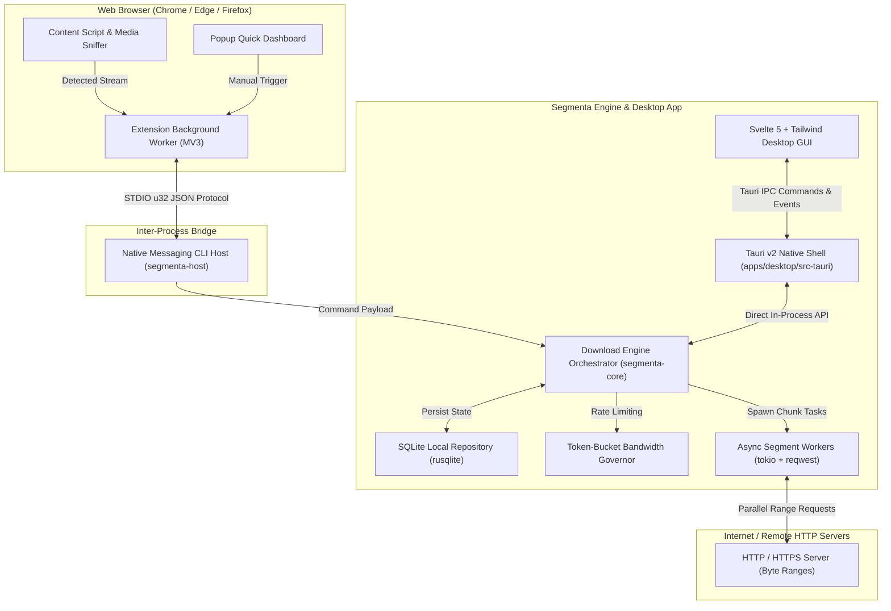

# Segmenta

<p align="center">
  
</p>

<p align="center">
  <strong>High-performance, modular, and privacy-respecting open-source internet download manager and media grabber.</strong>
</p>

<p align="center">
  <strong>Languages:</strong> <a href="README.md">English</a> | <a href="README.id.md">Bahasa Indonesia</a> | <a href="README.es.md">Español</a> | <a href="README.zh.md">简体中文</a> | <a href="README.ja.md">日本語</a>
</p>

<p align="center">
  <a href="https://github.com/prodhokter/segmenta/actions"></a>
  <a href="LICENSE"></a>
  <a href="https://www.rust-lang.org/"></a>
  <a href="https://v2.tauri.app/"></a>
  <a href="https://svelte.dev/"></a>
  <a href="https://developer.chrome.com/docs/extensions/develop/migrate/manifest-v3"></a>
</p>

---

## Overview

**Segmenta** is a modern, lightweight, and extensible download manager engineered as a privacy-first alternative to traditional tools like Internet Download Manager (IDM). It pairs an ultra-fast, asynchronous Rust core download engine with an editorial desktop interface built on Tauri v2 and Svelte 5, accompanied by a Manifest V3 browser extension with automated media sniffing.

### Key Capabilities
- **Multi-Connection Dynamic Slicing:** Accelerates download throughput by slicing files into 1–32 parallel HTTP `Range` streams with byte-accurate chunk reassembly.
- **Automatic Fallback:** Seamlessly detects non-range-capable servers (`Accept-Ranges: none` or `200 OK`) and falls back to robust single-stream writing.
- **HLS / M3U8 Streaming Media Extraction:** Complete parser and downloader for HLS playlists (`.m3u8`), supporting master variant selection (highest resolution/bandwidth stream) and parallel segment fetching with audio/video stream muxing.
- **Automated Task Scheduler:** Comprehensive scheduling engine allowing scheduled start and stop times (ISO-8601 / RFC 3339), queue concurrency limits, and time-window enforcement.
- **Multilingual Support (i18n):** Native support for English, Bahasa Indonesia, Español, Chinese, and Japanese directly switchable in Settings.
- **Customizable App Settings:** Global configuration for max concurrent downloads, default segment counts (1–32), global speed limits (KB/s), dark/light theme switching, and automatic category path routing.
- **Smart Media Sniffer:** Manifest V3 browser extension sniffs streaming video and audio elements (`.mp4`, `.m3u8`, `.mp3`) and provides a non-intrusive floating action overlay.
- **Authentication & Header Preservation:** Automatically captures and passes session cookies, `Referer`, and `User-Agent` headers across native IPC to prevent authentication drops.
- **Bandwidth Governor:** Token-bucket rate limiter enabling dynamic, sub-millisecond throughput shaping without resetting active connections.
- **Editorial Desktop Experience:** High-performance GUI featuring a 60 FPS Canvas speedometer, real-time segment chunk inspector, priority queueing, schedule dialogs, settings modal, and automatic file categorization.
- **Privacy-First & Secure:** Zero telemetry, no third-party tracking, strict local path sanitization against directory traversal, and loopback communication over standard STDIO/IPC.

---

## Architecture

Segmenta is organized as a unified monorepo containing modular Rust crates and frontend packages:



### Monorepo Structure

| Path | Description | Tech Stack |
| :--- | :--- | :--- |
| `crates/segmenta-core` | Core download engine, dynamic chunk scheduler, throttler, and SQLite repository. | Rust, Tokio, Reqwest, Rusqlite, Sha2 |
| `crates/segmenta-host` | Native Messaging Host executable for browser extension IPC bridge. | Rust, Serde JSON, Tokio STDIO |
| `apps/desktop` | Cross-platform desktop interface with real-time metrics and task management. | Tauri v2, Svelte 5, Tailwind CSS, TypeScript |
| `apps/extension` | Manifest V3 browser extension with automated stream sniffer and overlay trigger. | TypeScript, Vite, Chrome Extensions API |

---

## Quick Start & Installation

Segmenta provides multiple ready-to-run installation methods:

### 🚀 Method 1: Direct Executable (.EXE) & Double-Click Installer (Zero-Terminal)

For regular users who don't want to use terminals or build tools:
1. **Direct Launch:** Double-click `bin/Segmenta.exe` in the repository to run the app immediately.
2. **One-Click Installer (`INSTALL.bat`):** Double-click `INSTALL.bat` in the root folder:
   - Automatically creates a **Desktop Shortcut** on your Windows desktop.
   - Automatically registers the **Browser Extension Host** in the Windows Registry.
   - Automatically launches **Segmenta.exe**.

---

### 🛠️ Method 2: One-Click Automated Build Script (PowerShell)

To re-compile and register everything from source in one step:
```powershell
powershell -ExecutionPolicy Bypass -File .\scripts\install-windows.ps1
```

---

### 💻 Method 3: Developer Setup & Hot-Reload

```bash
# Install frontend dependencies
npm install

# Run workspace tests
cargo test --workspace

# Start Desktop in development mode with hot-reload
npm run dev:desktop
```

---

## Browser Native Messaging Setup

To allow the browser extension to forward intercepted downloads to the desktop engine:

### Chrome / Edge (Windows)
Create a registry key at `HKEY_CURRENT_USER\Software\Google\Chrome\NativeMessagingHosts\com.segmenta.downloader` (or `Microsoft\Edge\NativeMessagingHosts\...`) with the default value pointing to the absolute path of `manifest-chrome.json`.

### Firefox (Windows)
Create a registry key at `HKEY_CURRENT_USER\Software\Mozilla\NativeMessagingHosts\com.segmenta.downloader` with the default value pointing to `manifest-firefox.json`.

---

## Development & Quality Gate

Run full verification before submitting any changes:

```bash
# Check code formatting
cargo fmt --all -- --check

# Run Rust linter
cargo clippy --workspace --all-targets -- -D warnings

# Execute all tests
cargo test --workspace

# Validate Desktop frontend types and bundle
npm --prefix apps/desktop run check
npm --prefix apps/desktop run build

# Validate Extension frontend types and bundle
npm --prefix apps/extension run check
npm --prefix apps/extension run build
```

---

## Contributing

Contributions are welcome and appreciated. Please read [CONTRIBUTING.md](CONTRIBUTING.md) for development workflows, coding standards, and PR guidelines. All participants are expected to adhere to our [Code of Conduct](CODE_OF_CONDUCT.md).

---

## License

Segmenta is dual-licensed under either of:
- **Apache License, Version 2.0** ([LICENSE](LICENSE) or http://www.apache.org/licenses/LICENSE-2.0)
- **MIT License** ([LICENSE](LICENSE) or http://opensource.org/licenses/MIT)

at your option.
